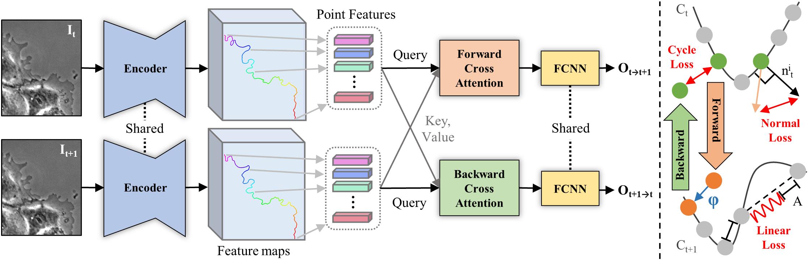

# Contour Tracking
### [Project Page](https://junbongjang.github.io/projects/contour-tracking/index.html) | [Paper](https://arxiv.org/abs/2303.08364) | [Data](https://zenodo.org/record/7754589)

**[Unsupervised Contour Tracking of Live Cells by Mechanical and Cycle Consistency Losses](https://junbongjang.github.io/projects/contour-tracking/index.html)**
 <br />
 [Junbong Jang](https://junbongjang.github.io/)<sup>1</sup>,
 [Kwonmoo Lee](https://research.childrenshospital.org/kwonmoo-lee)\*<sup>2,3</sup>,
 [Tae-Kyun Kim](https://sites.google.com/view/tkkim/home)\*<sup>1,4</sup>
 <br /><sup>1</sup>KAIST, <sup>2</sup>Boston Children's Hospital, <sup>3</sup>Harvard Medical School, <sup>4</sup>Imperial College London
 <br />*denotes corresponding authors
 <br />CVPR 2023

Tensorflow implementation of contour tracking of live cell and jellyfish videos.<br><br>

<div align="center">
    
</div>


## Setup
We ran this code in the following setting.
* Python 3.6.9
* Tensorflow 2.4.3
* CUDA 11.0
* Ubuntu 18.04

## Installation
Build and run Docker using our Dockerfile. For instance:
    
  >sudo docker build -t tf24_contour_tracking .

  >sudo docker run -v /home/junbong/contour-tracking:/home/docker/contour-tracking -v /data/junbong/optical_flow/generated_3_5_2023:/data/junbong/optical_flow/generated_3_5_2023 -v /data/junbong/optical_flow/assets:/data/junbong/optical_flow/assets --gpus '"device=0"' -it tf24_contour_tracking

Install Python dependencies in the requirements.txt
>pip install -r requirements.txt

## Data Pre-processing
Run the following pre-processing files inside the preprocessing folder in order as indicated by the number.

1. To create GT tracking points using our GUI, specify "movie_path" and "save_path" inside the "LoadMovie" function.
<br> Then, run

> python src/preprocessing/tracking_points_labeling_GUI.py

* Please label contour points in the same order for every frame. For instance, label top left contour point first and label bottom right contour point at the end for every frame. 
Otherwise, the contour point in the current frame is incorrectly mapped to the non-corresponding point in the next frame. 

2. (Optional) To create pseudo labels from the tracking results generated by **[MATLAB morphodynamics profiler](https://github.com/DanuserLab/Windowing-Protrusion)**, run
> python src/preprocessing/MATLAB_tracking_points.py

* If you don't create pseduo labels from MATLAB morphodynamics profiler, "main_process_tracking_points.py" will create the dummy pseudo labels which won't be used during training but is necessary since our contour tracker always take pseudo or GT labels as input.

3. To get ordered contour points along the boundary of the segmentation mask and convert ground truth tracking points in x and y coordinates to contour indices, <br>
  3.1. Set "dataset_name" equal to either 'PC', 'HACKS', 'JELLY' or create your own dataset_name <br>
  3.2. Specify root_assets_path, root_generated_path, processed_mask_folder, image_folder and dataset_folders <br>
  3.3. Run

> python src/preprocessing/main_process_tracking_points.py

* At the end, the following subfolders should be generated in the "root_generated_path": "images", "contour_points", and "tracked_points_in_contour_indices". The generated filenames for image, contour point, and tracked point should be the same for each frame. Otherwise, error can occur in the data conversion step so edit "main_process_tracking_points.py" code if that happens.
* In the preprocessing folder, we also included miscellaneous codes for drawing manuscript figures for reference. 

## Data Conversion to TFRecord
This section describes how to create tfrecords from the preprocessed results comprised of images, contour points in contour indices and tracked points in contour indices.
  In the folder specified by data_dir, there should be following subfolders: "images", "contour_points", and "tracked_points_in_contour_indices" 

1. Create folders named "training" and "test" and move the preprocessed result into either one of them. "training" folder can have multiple preprocessed videos but the "test" folder must only contain one preprocessed video.

2. To create the TFRecord for training set
>python -m src.data_conversion_scripts.convert_custom_to_tfrecords --data_dir=/data/junbong/optical_flow/assets/data_processed_pc/ --shard=0 --num_shards=1 --img_format=png --data_split=training

3. To create the TFRecord for test set
>python -m src.data_conversion_scripts.convert_custom_to_tfrecords --data_dir=/data/junbong/optical_flow/assets/data_processed_pc/ --shard=0 --num_shards=1 --img_format=png --data_split=test

## Training

1. Edit src/uflow_flags.py to change hyperparameters such as learning rate and number of training steps. 

2. Set arguments for "src.contour_flow_main" such as "train_on", "valid_on", 'height', 'width' and 'generated_dir' in the commands as current paths and settings are specified for my use case.

Below are the examples of command that I ran to train on MARS-Net, HACKS or Jellyfish datasets. Also, 

###### MARS-Net dataset (all 200 frames)
>python -m src.contour_flow_main --train_on=custom:/data/junbong/optical_flow/assets/pc_5small_dense_matlab_seg_all_points/tfrecord/training/ --valid_on=custom:/data/junbong/optical_flow/assets/pc_5small_dense_matlab_seg_all_points/tfrecord/test4/ --height=256 --width=256 --generated_dir=/data/junbong/optical_flow/generated_3_5_2023/pc_5small_dense_matlab_seg_all_points_cycle_normal_decay_re_batch8/ --use_tracking_points --use_seg_points --batch_size=8

###### HACKS dataset (all 200 frames)
>python -m src.contour_flow_main --train_on=custom:uflow/assets/HACKS_live/tfrecord/training/ --valid_on=custom:uflow/assets/HACKS_live/tfrecord/valid/ --height=512 --width=512 --generated_dir=uflow/generated/HACKS_live_cycle_normal_batch8/ --use_tracking_points --use_seg_points --batch_size=8

###### For comparison against UFlow method, change the code in contour_flow_net.py before running this
>python -m src.contour_flow_main --train_on=custom:uflow/assets/pc_5small_sparse_matlab_seg_all_points/tfrecord/training/ --height=256 --width=256 --generated_dir=uflow/generated/pc_5small_sparse_matlab_seg_all_points_uflow_batch8/ --use_segmentations --use_tracking_points --batch_size=8

>python -m src.contour_flow_main --train_on=custom:uflow/assets/HACKS_live/tfrecord/training/ --height=512 --width=512 --generated_dir=uflow/generated/HACKS_live_uflow_batch8/ --use_segmentations --use_tracking_points --batch_size=8

###### For comparison against PoST method, change the code in tracking_model.py before running this
>python -m src.contour_flow_main --train_on=custom:uflow/assets/pc_5small_dense_matlab_seg_all_points/tfrecord/training/ --valid_on=custom:uflow/assets/pc_5small_dense_matlab_seg_all_points/tfrecord/test4/ --height=256 --width=256 --generated_dir=uflow/generated/pc_5small_dense_matlab_seg_all_points_post_batch8/ --use_tracking_points --use_seg_points --batch_size=8

>python -m src.contour_flow_main --train_on=custom:uflow/assets/HACKS_live/tfrecord/training/ --valid_on=custom:uflow/assets/HACKS_live/tfrecord/test9/ --height=512 --width=512 --generated_dir=uflow/generated/HACKS_live_post_batch8/ --use_tracking_points --use_seg_points --batch_size=8

###### For Jellyfish
>python -m src.contour_flow_main --train_on=custom:uflow/assets/Jellyfish/tfrecord/training/ --valid_on=custom:uflow/assets/Jellyfish/tfrecord/test/ --height=256 --width=256 --generated_dir=uflow/generated/Jellyfish_live_cycle_normal_batch8/ --use_tracking_points --use_seg_points --batch_size=8

>python -m src.contour_flow_main --predict_on=custom:uflow/assets/Jellyfish/tfrecord/test/ --generated_dir=uflow/generated/Jellyfish_live_cycle_normal_batch8/  --use_seg_points --use_tracking_points --width=512 --height=512

## Prediction

##### To predict Phase Contrast or Fluorescence Confocal live cell videos all at once, modify and run
>./batch_predict.sh

##### To predict an individual live cell dataset
>python -m src.contour_flow_main --predict_on=custom:uflow/assets/pc_5small_dense_matlab_seg_all_points/tfrecord/valid/ --generated_dir=uflow/generated/pc_5small_dense_matlab_seg_all_points_match_lam3_batch8/  --use_seg_points --use_tracking_points --width=256 --height=256

>python -m src.contour_flow_main --predict_on=custom:uflow/assets/HACKS_live/tfrecord/valid/ --generated_dir=uflow/generated/HACKS_live_cycle_normal_batch8/  --use_seg_points --use_tracking_points --width=512 --height=512

## Citation
```
@inproceedings{jang2023contourtracking,
  title={Unsupervised Contour Tracking of Live Cells by Mechanical and Cycle Consistency Losses},
  author={Jang, Junbong and Lee, Kwonmoo and Kim, Tae-Kyun},
  booktitle={CVPR},
  year={2023}
}
```

## Acknowledgements
This program is built upon **[UFlow](https://github.com/google-research/google-research/tree/master/uflow)**, a library for research on unsupervised learning of optical flow from **[What Matters in Unsupervised Optical Flow](https://arxiv.org/pdf/2006.04902.pdf)**.
Also, we utilized the **[code](https://github.com/ghnam-ken/PoST)** from **[Polygonal Point Set Tracking](https://arxiv.org/pdf/2105.14584.pdf)** paper and **[cellular morphodynamics profiling software](https://github.com/DanuserLab/Windowing-Protrusion)** from **[Morphodynamic Profiling of Protrusion Phenotypes](https://www.ncbi.nlm.nih.gov/pmc/articles/PMC1367294/)** paper.
<br />We thank every member of KAIST Computer Vision and Learning (KCVL) lab for proofreading our manuscript and providing valuable feedbacks and moral supports.
